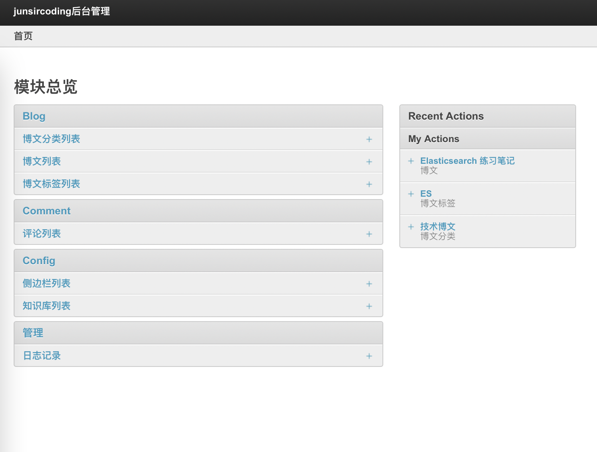

# junsircoding 的博客

## 介绍

系统源码编写是学习了[《Django企业开发实战》](https://item.jd.com/12537842.html)一书，作者 [the5fire](https://www.the5fire.com/). 

[系统库表 ER 图](https://editor.ponyorm.com/user/junsircoding/junsirblog/designer)使用 [ponyorm](https://ponyorm.org/) 绘制. 


## 环境搭建

1. 创建 conda 环境

    ```shell
    conda env create -n blog_env -f ./environment.yaml
    ```

2. 安装 Redis

  - 从官网下载[源码包](http://download.redis.io/releases/redis-6.2.6.tar.gz), 
  - 将其移动到合适的位置
  - 编译安装
    ```shell
    # Linux
    sudo make
    sudo make test
    sudo make install

    # Mac
    brew install redis
    ```

3. 迁移建表

    ```shell
    django-admin migrate
    ```

4. 补充你自己的项目密钥

`junsircoding/settings/settings.py` 的 SECRET_KEY

5. 创建管理员账号密码

    ```shell
    python manage.py createsuperuser
    ```

6. 从后台录入文章

    ```http
    http://127.0.0.1:8000/junsiradmin/
    ```

## 运行截图

1. 博客主界面


2. 底部评论


3. 后台界面登录


4. 录入文章




## 部署

部署方式是 Gunicorn 在本地运行服务，然后由 Nginx 做代理. 

- 1.关闭 Gunicorn 服务
    ```shell
    ps -aux | grep gunicorn
    kill -9 [gunicorn进程号]
    ```
- 2.开启 Gunicorn 服务
    ```shell
    cd /path/to/blog/root/floder
    gunicorn junsircoding.wsgi:application -w 3 -k gthread -b 127.0.0.1:8000 --max-requests=10000 -D
    ```
- 3.重启 Nginx
    ```shell
    cd /usr/sbin/
    ./nginx -s reload
    ```

## 服务管理脚本

```shell
# grep 出 gunicorn 进程
GUNICORN_PID=$(ps -aux | grep gunicorn | grep -v grep | awk '{print $2}')
echo "Gunicorn pid are "${GUNICORN_PID}

# kill 掉 gunicorn 的进程
kill -9 ${GUNICORN_PID}
echo "Gunicorn process already killed"

# 进入 manage.py 同级目录
cd /path/to/blog/root/floder

# 激活虚拟环境
source /root/miniconda3/bin/activate /root/miniconda3/envs/blog_dev
echo "blog_dev miniconda enviroment already activated"

# 开启 gunicorn 进程
gunicorn junsircoding.wsgi:application -w 3 -k gthread -b 127.0.0.1:8000 --max-requests=10000 -D
echo "Gunicorn process already started"

# 重启 nginx
/usr/sbin/nginx -s reload
echo "Nginx already reload"
```

## 备份侧边栏代码

若要使用将其拷贝至 `junsircoding/themes/bootstrap/templates/blog/base.html` 即可, 这里为了简洁去掉了侧边栏.

```html
      <div class="col-3">
        
        
        <div class="card bg-light mb-3" style="max-width: 18rem;">
          <div class="card-body">
            <h5 class="card-title">{{ sidebar.title }}</h5>
          </div>
          {{ sidebar.content_html }}
        </div>
        
        
      </div>
```
